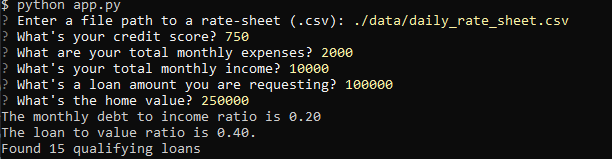

# **Loan Qualifier**

## Loan qualifier is an interactive tool that allows users to identify loan providers, for which a loan applicant would be eligible based on the applicant's credit score, debt-to-income ratio and loan-to-value ratio, as well as the requested loan size.

---

## 

---

## Technologies

`Python 3.9`

_Prerequisites_

fire and Questionary are python libraries that enable command line interfaces (CLI).
Users can provide an input to the code by using CLI's when running the program:

- [fire](https://github.com/google/python-fire) - For the command line interface, help page, and entry-point.

- [Questionary](https://github.com/tmbo/questionary) - For interactive user prompts and dialogs.

---

## Installation Guide

Open your terminal (PowerShell, Command Prompt App. or Git Bash).

Before using the application first install the following dependencies by using your terminal:

To install fire run:

```python
pip install fire
```

To install Questionary run:

```python
pip install questionary
```

---

## Usage

To use the application launch it from your shall/terminal/Git Bash. Once launched, a number of questions relating to the loan application will appear on the screen. Your answers to those questions will serve as filters the tool will apply to the list of loan providers.
NOTE: the path requested by the prompt messages is to the data file containg the list of loan providers. <br />



The tool will output to the screen debt-to-income ratio and loan-to-value ratio of the loan and a number of qualified providers found by allplying the filters, as well as the filtered list of qualifying providers saved in the same directory as the tool.

---

## Contributors

Contact Details:

Boris Dudkin:

- [Email](boris.dudkin@gmail.com)
- [LinkedIn](www.linkedin.com/in/Boris-Dudkin)

---

## License

MIT
