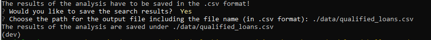

# **Loan Qualifier**

### Loan qualifier is an interactive tool that allows users to identify loan providers, for which a loan applicant would be eligible based on the applicant's credit score, debt-to-income ratio and loan-to-value ratio, as well as the requested loan size.

---

## 

---

## Table of contents

1. [Technologies](#technologies)
2. [Installation Guide](#installation-guide)
3. [Usage](#usage)
4. [Contributors](#contributors)
5. [License](#license)

---

## Technologies

`Python 3.9`

**Prerequisites**

fire and Questionary are python libraries that enable command line interfaces (CLI).
Users can provide an input to the code by using CLI's when running the program:

- [fire](https://github.com/google/python-fire) - For the command line interface, help page, and entry-point.

- [Questionary](https://github.com/tmbo/questionary) - For interactive user prompts and dialogs.

---

## Installation Guide

Open your terminal (PowerShell, Command Prompt App. or Git Bash).

Before using the application first install the following dependencies by using your terminal:

To install fire run:

```python
pip install fire
```

To install Questionary run:

```python
pip install questionary
```

---

## Usage

Clone the Repository

- Open a terminal window and use `cd` commands to navigate to the directory where you would like to save your repository.

- Use the `git clone` command and the link you copied previously to clone the repository in the location you selected.

To use the application, launch it from your terminal: <br />

```python
python app.py
```

Once the tool is launched, a number of questions relating to the loan application will appear on the screen. Your answers to those questions will serve as filters to the list of loan providers. <br />
NOTE: the first path requested by the prompt messages is to the data file containg the list of loan providers. <br />


The tool will output to the screen the debt-to-income and the loan-to-value ratios of the loan and the number of qualified providers found by applying the filters. <br />
You will be asked if you would like to save the list of qualified providers. If you respond with a "yes" and there are qualified banks, the output will be saved in the location and the file (in .csv format) specified by you via a command line interface (CLI). <br />
Some examples of CLI messages and responses are shown below: <br />

 <br />
 <br />


---

## Contributors

Contact Details:

Boris Dudkin

- [Email](boris.dudkin@gmail.com)
- [LinkedIn](https://www.linkedin.com/in/Boris-Dudkin/)

---

## License

MIT
